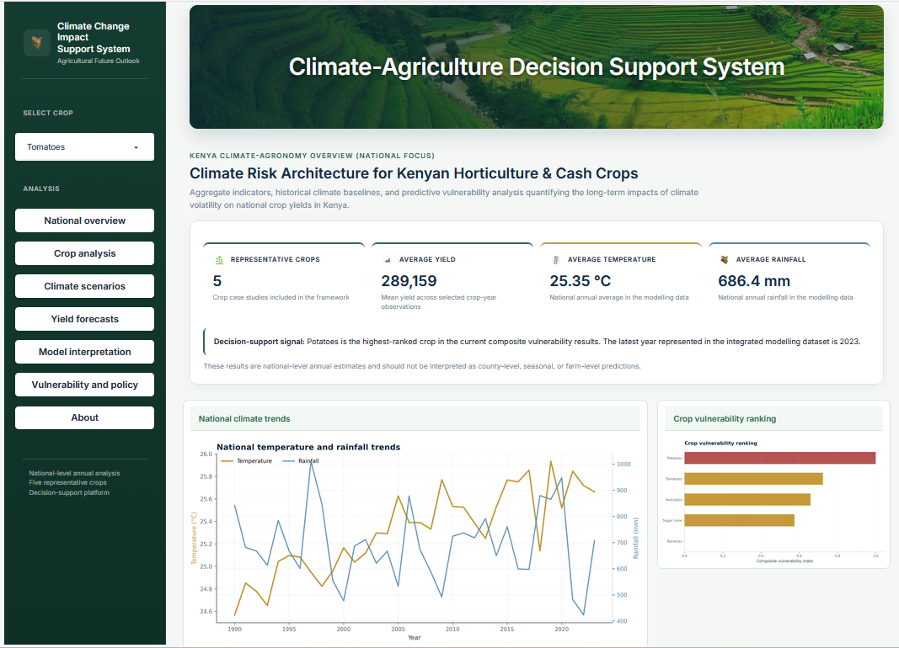
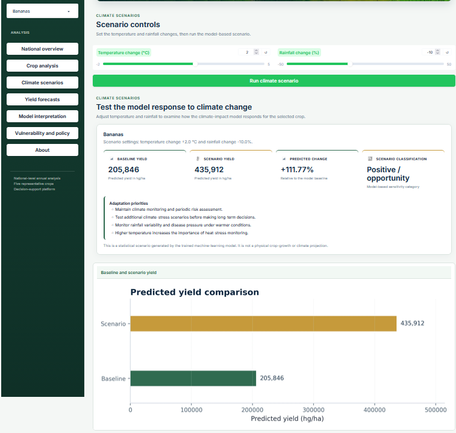
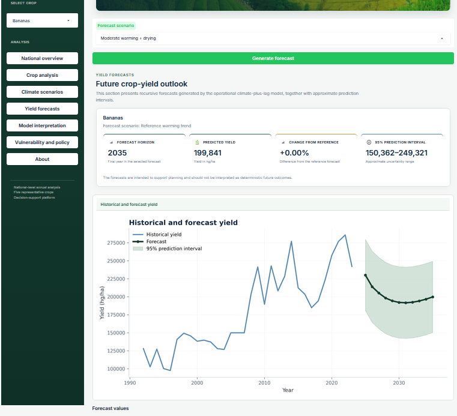
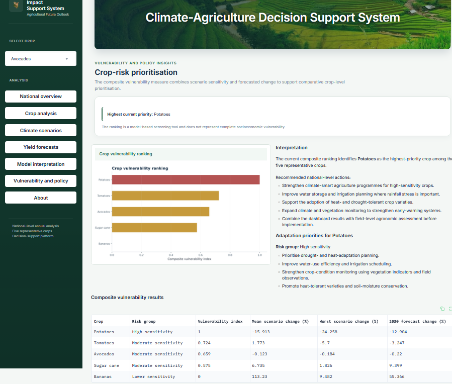
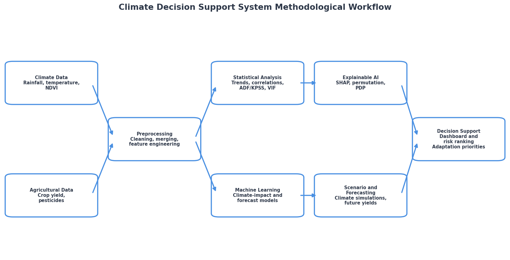

# Climate–Agriculture Decision Support System

An explainable machine-learning platform for analysing climate impacts on agricultural productivity in Kenya through climate-trend analysis, crop-yield modelling, explainable artificial intelligence, scenario simulation, recursive forecasting, vulnerability ranking, and an interactive decision-support dashboard.

---

## Project Purpose

The **Climate–Agriculture Decision Support System** is a reproducible climate–agriculture analytics platform developed from the research project:

> **The Prediction of the Impact of Climate Change on Agricultural Productivity in Kenya Using Machine Learning**

The project integrates long-term climate records, crop-yield observations, pesticide-use indicators, vegetation information, statistical analysis, machine-learning models, explainable artificial intelligence, climate-scenario simulation, recursive forecasting, and crop-vulnerability ranking in one transparent workflow.

The system is intended to support researchers, agricultural planners, policy analysts, students, and other users who need a national-level understanding of how climate variability and long-term climate change may relate to agricultural productivity in Kenya.

The platform is a **decision-support and research system**. It is not a physical crop-growth model, a causal-inference system, or a farm-level advisory service.

--

## System Interface

### National Overview



### Climate Scenario Analysis



### Yield Forecasting



### Vulnerability and Policy Insights



---

## Research Scope

- **Geographical scope:** Kenya
- **Temporal resolution:** Annual
- **Unit of analysis:** National crop-year observations
- **Representative crops:** Sugar cane, potatoes, tomatoes, bananas, and avocados
- **Primary outcome:** Crop yield in hectograms per hectare (`Yield_hg_ha`)
- **Interpretation scale:** National-level patterns; results are not county-level, seasonal, or farm-level predictions

The five representative crops cover different agricultural roles:

| Crop | Agricultural role |
|---|---|
| Sugar cane | Industrial cash crop with high water demand |
| Potatoes | Staple root and tuber crop important for food security |
| Tomatoes | Horticultural vegetable crop |
| Bananas | Tropical perennial food crop |
| Avocados | High-value horticultural and export crop |

---

## Objectives

The experiment is designed to:

1. assess long-term trends in temperature, rainfall, vegetation condition, and crop yield
2. quantify crop-specific relationships between climate indicators and agricultural productivity
3. compare baseline, linear, regularised, ensemble, and boosting regression algorithms
4. distinguish climate-impact interpretation from operational forecasting through separate feature sets
5. explain model behaviour using permutation importance and SHAP where applicable
6. simulate crop-yield responses under selected temperature and rainfall scenarios
7. generate recursive future-yield forecasts with approximate uncertainty intervals
8. rank representative crops using a composite climate-vulnerability index and
9. communicate the results through an interactive decision-support dashboard.

---

## Data Sources and Provenance

This repository contains Kenya-specific data extracts prepared from larger global climate and agricultural datasets. Kenya was selected as the study area, and the original source data were filtered, cleaned, aggregated, and integrated to support national-level annual climate–agriculture analysis.

The repository does not claim ownership of the original datasets. Data ownership, licensing conditions, and usage requirements remain with the respective data providers. The Kenya datasets included in this repository are research-ready derived extracts prepared for the Climate–Agriculture Decision Support System.

The original data platforms provide broader geographic coverage. Researchers wishing to apply this framework to another country or region can retrieve the relevant national records from the same platforms and reproduce the preprocessing, feature-engineering, statistical-analysis, machine-learning, scenario-simulation, forecasting, and vulnerability-ranking workflow.

| Dataset | Primary source | Coverage used in the project |
|---|---|---:|
| Rainfall | World Bank Climate Change Knowledge Portal | 1950–2024 |
| Temperature | World Bank Climate Change Knowledge Portal | 1950–2023 |
| Crop yield | FAO/FAOSTAT | 1961–2024 |
| Pesticide use | FAO/FAOSTAT | 1990–2023 |
| NDVI-related vegetation data | FAO-derived project extract | 1984–2026 |

### Official Data Portals

- **World Bank Climate Change Knowledge Portal:** https://climateknowledgeportal.worldbank.org/
- **World Bank Climate Change Knowledge Portal — Kenya:** https://climateknowledgeportal.worldbank.org/country/kenya
- **FAOSTAT:** https://www.fao.org/faostat/en/#home
- **FAOSTAT Data Portal:** https://www.fao.org/faostat/en/#data
- **FAO Pesticides Use and Trade, 1990–2023:** https://www.fao.org/statistics/highlights-archive/highlights-detail/pesticides-use-and-trade-1990-2023/en

The complete multivariable modelling window is constrained by the common overlap of the selected variables. Pesticide-use data begin in 1990, so the full integrated model uses the common period available after merging. Longer climate–yield analyses are retained where the relevant variables permit.

Detailed provenance, preprocessing notes, limitations, and regional adaptation guidance are available in [`docs/DATA_SOURCES.md`](docs/DATA_SOURCES.md).

---

## Regional Reusability

The framework can be adapted to other countries or regions because the original data platforms provide global or multi-country coverage.

To apply the framework elsewhere:

1. download the required climate and agricultural records for the selected country or region;
2. standardise year fields, variable names, units, and geographic identifiers;
3. apply the preprocessing and annual aggregation procedures documented in the notebook;
4. recalculate climate and vegetation anomalies using suitable regional baselines;
5. select locally relevant representative crops;
6. retrain and evaluate the machine-learning models using the regional data;
7. recalculate scenario responses, forecasts, and vulnerability rankings; and
8. update the decision-support dashboard with the new regional outputs.

Because agricultural systems differ across locations, model results should be interpreted within the local climatic, agronomic, socioeconomic, and data-availability context.

---

## Methodological Workflow

<p align="center">
  
</p>

The experiment follows these stages:

1. **Environment setup and reproducibility**  
   Prepare the Python environment and document the required software packages.

2. **Data sourcing and quality assessment**  
   Load the source datasets, inspect temporal coverage, verify fields, and summarise missingness.

3. **Representative crop selection**  
   Define the five crop case studies and document their agricultural roles.

4. **Data preparation and integration**  
   Aggregate annual climate variables, prepare agricultural variables, calculate annual NDVI anomaly, and merge the datasets by year.

5. **Feature engineering**  
   Construct rainfall, temperature, and NDVI anomalies; drought, wet, and heat-stress indicators; and lagged-yield predictors.

6. **Climate and crop-yield trend analysis**  
   Apply linear trend estimation, Kendall-based trend tests, and Sen-slope approximations.

7. **Statistical validation**  
   Evaluate Pearson and Spearman relationships, ADF and KPSS stationarity, Variance Inflation Factors, and residual autocorrelation.

8. **Machine-learning modelling**  
   Compare Naive Mean, Linear Regression, Ridge Regression, Bayesian Ridge, Random Forest, Gradient Boosting, XGBoost, and CatBoost using time-aware validation.

9. **Model evaluation and selection**  
   Report R², MAE, RMSE, MAPE, and cross-validation statistics. RMSE is used as the primary selection criterion and is interpreted alongside the other metrics.

10. **Explainable modelling**  
    Use permutation importance and SHAP, where supported, to identify variables that influence predictions. These explanations are predictive rather than causal.

11. **Climate-scenario simulation**  
    Modify temperature and rainfall inputs to assess how selected climate-impact models respond statistically.

12. **Recursive forecasting**  
    Generate future crop-yield pathways from the operational climate-plus-lag models and estimate approximate prediction intervals.

13. **Composite vulnerability ranking**  
    Combine scenario sensitivity and forecast results into a comparative crop-level vulnerability index.

14. **Interactive decision-support dashboard**  
    Present national indicators, crop analysis, climate scenarios, yield forecasts, model interpretation, and vulnerability insights.

---

## Model Design

Two modelling tracks are maintained:

- **Climate-only models:** used for climate-impact interpretation, scenario simulation, and clearer examination of climate-related predictors.
- **Climate-plus-lag models:** used for operational forecasting because previous yield values capture temporal persistence and other unobserved historical influences.

No single algorithm is assumed to be universally best. Model selection is performed separately for each crop and analytical purpose.

---

## Technologies

- Python 3.10 or later
- Jupyter Notebook, JupyterLab, or Google Colab
- NumPy
- pandas
- Matplotlib
- SciPy
- scikit-learn
- statsmodels
- XGBoost
- CatBoost
- SHAP
- Gradio
- Pillow
- gdown
- IPython

---

## Repository Structure

```text
kenya-climate-agriculture-decision-support-system/
│
├── README.md
├── Climate_Agriculture_Decision_Support_System.ipynb
├── requirements.txt
│
├── assets/
│   └── app_images/
│
├── data/
│   └── kenya/
│
├── docs/
│   ├── DATA_SOURCES.md
│   ├── ASSET_ATTRIBUTION.md
│   └── screenshots/
│
└── outputs/
    ├── figures/
    └── tables/
```

---

## Repository Outputs

When the notebook is executed, it creates organised outputs for:

- publication figures;
- result tables;
- trained models;
- exported analytical files;
- dashboard assets; and
- reproducibility requirements.

Publication figures and result tables retain numbered filenames so they can be mapped consistently to the accompanying research report.

---

## Running the Experiment

### 1. Clone the Repository

```bash
git clone https://github.com/KimaniMbugua/kenya-climate-agriculture-decision-support-system.git
cd kenya-climate-agriculture-decision-support-system
```

### 2. Install the Required Packages

```bash
pip install -r requirements.txt
```

### 3. Open the Notebook

Open:

```text
Climate_Agriculture_Decision_Support_System.ipynb
```

in Google Colab, JupyterLab, or Jupyter Notebook.

### 4. Execute the Workflow

1. Run the environment-setup cells.
2. Execute the notebook from top to bottom.
3. Confirm that the source datasets are accessible.
4. Review the generated tables and figures.
5. Launch the interactive dashboard after the analytical sections have completed.

---

## Visual Asset Notice

The dashboard was developed using agricultural photographs and interface assets obtained from publicly accessible online sources for academic research and prototype development. Ownership remains with the original creators.

Where licensing information was available, it is documented in [`docs/ASSET_ATTRIBUTION.md`](docs/ASSET_ATTRIBUTION.md). Visual assets without a verified redistribution licence are not covered by any software licence applied to this repository and should not be reused independently without permission from the relevant rights holder.

---

## Responsible Interpretation

The outputs are national-level, annual, model-based estimates. Crop productivity is also affected by soil conditions, irrigation, fertiliser use, crop varieties, pests, diseases, management practices, markets, and policy conditions that are not fully represented in the available datasets.

Negative or weak out-of-sample R² values should be interpreted as evidence of prediction difficulty and omitted-variable limitations rather than concealed or corrected.

Scenario results are statistical responses of trained machine-learning models, not deterministic biophysical projections. Feature-importance and SHAP results describe predictive influence and do not establish causality. The composite vulnerability index is a comparative screening tool and does not represent complete socioeconomic vulnerability.

---

## Main Notebook

The complete analytical workflow is available in:

[`Climate_Agriculture_Decision_Support_System.ipynb`](Climate_Agriculture_Decision_Support_System.ipynb)

The notebook contains:

- data loading;
- preprocessing and integration;
- feature engineering;
- exploratory analysis;
- statistical testing;
- machine-learning modelling;
- model comparison;
- explainable AI;
- climate-scenario simulation;
- recursive forecasting;
- vulnerability ranking; and
- interactive dashboard development.

---

## Citation

Suggested citation:

```text
Kimani, S. (2026). Climate–Agriculture Decision Support System: An Explainable
Machine-Learning Framework for Climate-Impact Assessment, Crop-Yield Forecasting,
Scenario Simulation, and Vulnerability Analysis in Kenya. GitHub repository.
https://github.com/KimaniMbugua/kenya-climate-agriculture-decision-support-system
```

---

## Author

**Samuel Kimani**

Copyright © 2026 Samuel Kimani.
